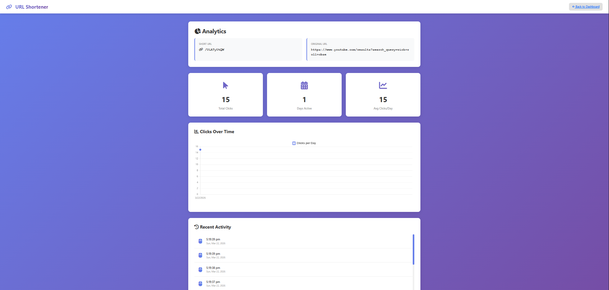
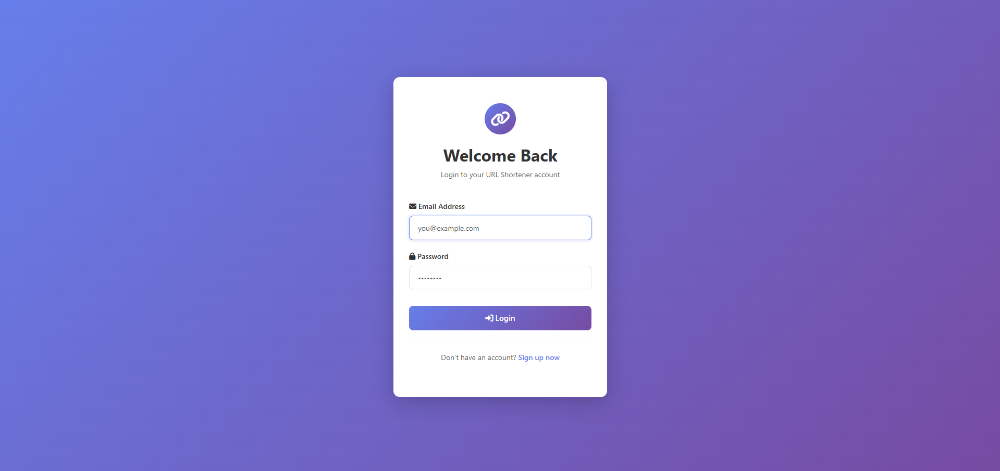
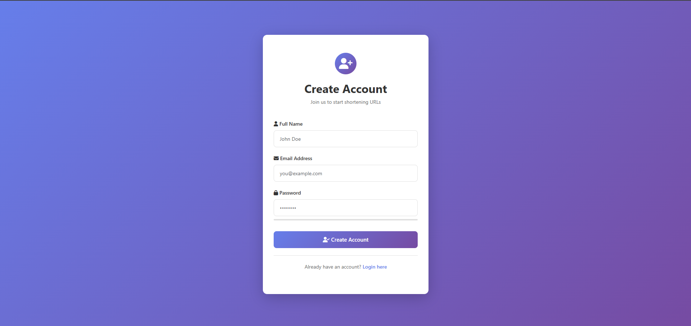
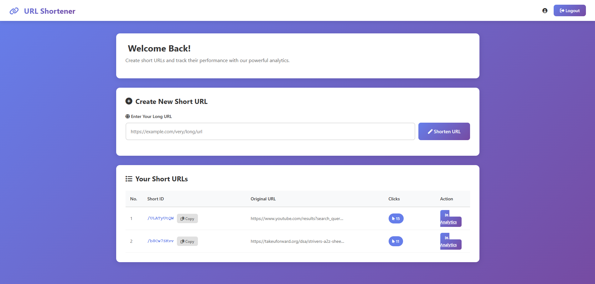

# 🔗 URL Shortener API

A backend service that generates short URLs and efficiently redirects users to the original links.

---

## ❗ Problem

Long URLs are difficult to share, remember, and manage.

This API provides a scalable backend solution to generate short, unique links and redirect users efficiently.

---

## 🔗 Key Features

* Generate unique short URLs
* Redirect to original URLs
* Optimized lookup using MongoDB indexing
* Input validation and error handling
* RESTful API design
* Scalable URL mapping system

---

## ⚙️ Tech Stack

* Node.js
* Express.js
* MongoDB (Mongoose)

---

## 🏗 Architecture

* Controllers → Business logic
* Models → Database schema
* Routes → API endpoints

---

## 📡 API Endpoints

* POST `/shorten`
* GET `/:shortId`

---

## 📦 Sample Flow

### Create Short URL

POST `/shorten`

```json
{
  "originalUrl": "https://example.com"
}
```

### Response

```json
{
  "shortUrl": "http://localhost:5000/abc123"
}
```

---

## 🛠 Run Locally

```bash
git clone <your-repo-link>
cd url-shortener-api
npm install
npm start
```

Create a `.env` file using `.env.example`

---

## 📸 Preview

### Analytics Dashboard


### Login Page


### Authentication Page


### Dashboard Home


---

## 📌 Base URL

http://localhost:5000

---

## 👨‍💻 Author

Krishiv
